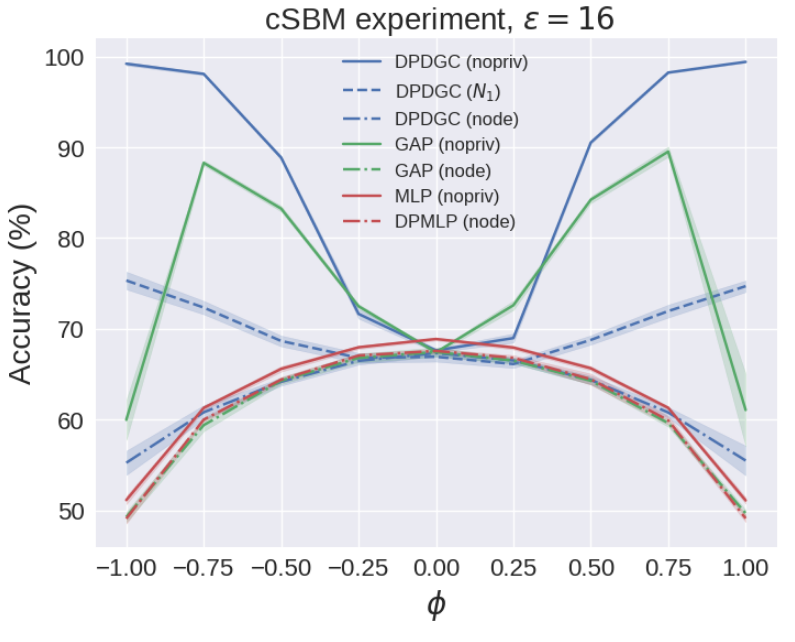
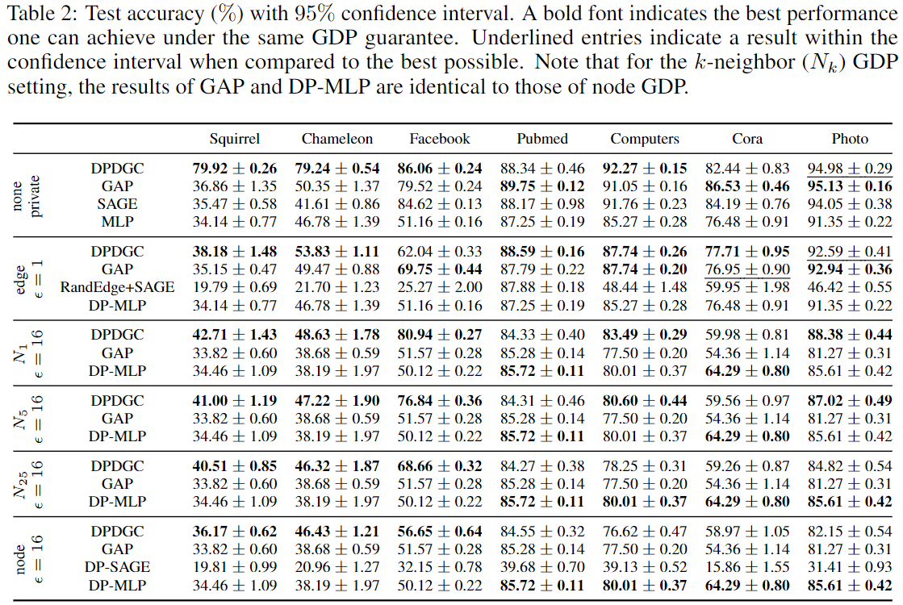

# DP-GNN
This is the official repository for [DPDGC: Differentially Private Decoupled Graph Convolutions for Multigranular Topology Protection (NeurIPS 2023)](https://arxiv.org/abs/2307.06422). We study the problem of differential privacy (DP) for GNNs (i.e., DP-GNNs) starting from the definition. Note that a refined camera-ready version will be online soon.

# Environment Setup
We conducted our code tests on a Linux machine running CentOS 7.9.2009 and Python 3.9.16. For the necessary packages, please refer to `requirements.txt`. It's important to note that `scipy` needs to be downgraded to version 1.8.0 to ensure compatibility with autodp due to a recognized [issue](https://github.com/yuxiangw/autodp/issues/40).

# Usage
We have consolidated all functionalities within `train.py`. To execute the code with the default parameters, use the command:

`python train.py $dp_method --dataset $dataset --epsilon $epsilon --project $output_folder`

Here:

- `$dp_method` is the desired DP method.
- `$dataset` is the dataset you wish to test.
- `$epsilon` is the specified value of epsilon.
- `$output_folder` is the directory where results will be stored.

Currently, we support the following DP methods

- mlp, mlp-dp
- gap-inf, gap-edp, gap-ndp
- sage-inf, sage-edp, sage-ndp
- dpdgc-inf, dpdgc-edp, dpdgc-ndp, dpdgc-kndp

To reproduce the results shown in our paper and below, you can use the shell scripts in `train_scripts` with fine-tuned parameters. 





# Contact

Please contact Chao Pan (chaopan2@illinois.edu), Eli Chien (ichien3@illinois.edu) if you have any question.

# Citation

If you use our code in your work, please cite our paper:

```
@article{chien2023differentially,
  title={Differentially Private Decoupled Graph Convolutions for Multigranular Topology Protection},
  author={Chien, Eli and Chen, Wei-Ning and Pan, Chao and Li, Pan and {\"O}zg{\"u}r, Ayfer and Milenkovic, Olgica},
  journal={arXiv preprint arXiv:2307.06422},
  year={2023}
}
```

Please also cite the GAP paper as our code is mainly developed based on their [repository](https://github.com/sisaman/GAP).

```
@inproceedings{sajadmanesh2023gap,
  title={Gap: Differentially private graph neural networks with aggregation perturbation},
  author={Sajadmanesh, Sina and Shamsabadi, Ali Shahin and Bellet, Aur{\'e}lien and Gatica-Perez, Daniel},
  booktitle={USENIX Security 2023-32nd USENIX Security Symposium},
  year={2023}
}
```

Please also cite the LINKX paper as our DPDGC is developed based on its official implementation.

```
@article{lim2021large,
  title={Large scale learning on non-homophilous graphs: New benchmarks and strong simple methods},
  author={Lim, Derek and Hohne, Felix and Li, Xiuyu and Huang, Sijia Linda and Gupta, Vaishnavi and Bhalerao, Omkar and Lim, Ser Nam},
  journal={Advances in Neural Information Processing Systems},
  volume={34},
  pages={20887--20902},
  year={2021}
}
```

Please cite the GPRGNN paper if you use the cSBM synthetic dataset, as our code pertaining to cSBM is directly adopted from their [repository](https://github.com/jianhao2016/GPRGNN).

```
@inproceedings{
chien2021adaptive,
title={Adaptive Universal Generalized PageRank Graph Neural Network},
author={Eli Chien and Jianhao Peng and Pan Li and Olgica Milenkovic},
booktitle={International Conference on Learning Representations},
year={2021},
url={https://openreview.net/forum?id=n6jl7fLxrP}
}
```
